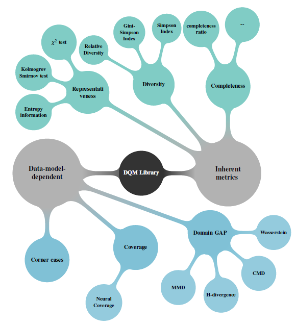

# DQM-ML: Data Quality Metrics for Machine Learning

## Workspace common Badge and CI / CD informations

[![License: Apache 2.0][license-badge]](https://opensource.org/license/apache-2-0)
![Python][python-badge]
![Repo Size][size-badge]

[![CI][github-actions-badge]](https://github.com/Safenai/dqm-ml-workspace/actions)
[![Ruff][ruff-badge]](https://github.com/astral-sh/ruff)
[![uv][uv-badge]](https://github.com/astral-sh/uv)
[![Nox][nox-badge]](https://nox.thea.codes/en/stable/)
[![Checked with mypy][mypy-badge]](https://mypy-lang.org/)

[](https://sonarcloud.io/summary/new_code?id=Safenai_dqm-ml-workspace)
[](https://sonarcloud.io/summary/new_code?id=Safenai_dqm-ml-workspace)

[license-badge]: https://img.shields.io/badge/License-Apache%202.0-brightgreen.svg
[size-badge]: https://img.shields.io/github/repo-size/Safenai/dqm-ml-workspace
[python-badge]: https://img.shields.io/badge/python-3.12%20|%203.13-blue.svg

[github-actions-badge]: https://github.com/Safenai/dqm-ml-workspace/actions/workflows/ci.yml/badge.svg
[uv-badge]: https://img.shields.io/endpoint?url=https://raw.githubusercontent.com/astral-sh/uv/main/assets/badge/v0.json
[nox-badge]: https://img.shields.io/badge/%F0%9F%A6%8A-Nox-D85E00.svg
[ruff-badge]: https://img.shields.io/endpoint?url=https://raw.githubusercontent.com/astral-sh/ruff/main/assets/badge/v2.json
[mypy-badge]: https://www.mypy-lang.org/static/mypy_badge.svg


## Origins - who create first the DQM-ML

The library was originally developed in the program:

<div align="center">
    
</div>


> [!IMPORTANT]
> This repository groups all packages derived from [dqm-ml](https://github.com/IRT-SystemX/dqm-ml/blob/main/README.md) to initiate what shall become dqm-ml v2.0.0.
> All what has been implemented rely on 
> (Definitions from [Confiance.ai program](https://www.confiance.ai/)) a research program, which focused on trustworthy AI for industry.
> Asset developped during the program were transfered to [European Trustworthy AI Association](https://trustworthy-ai-association.eu) and 

>This work was carried out as part of activities conducted and partially funded by the [European Trustworthy AI Association](https://trustworthy-ai-association.eu), which aims to shape trustworthy AI and empower industry through state-of-the-art, open-source methodologies and tools. 
 
For more technical and scientific details, refer to:

- **[HAL Publication](https://hal.science/hal-04719346v1)** — Academic paper describing the methodology
- **[ETAIA Asset](https://catalog.trustworthy-ai-association.eu/records/968fj-fk177)**
- **[Scientific Deliverable](https://catalog.confiance.ai/records/p46p6-1wt83/files/Scientific_Contribution_For_Data_quality_assessment_metrics_for_Machine_learning_process-v2.pdf)** — Detailed technical documentation
- **[Why creating DQM-ML-V2](./docs/dqm-ml-v2.md)** — Evolution need in dqm-ml


## Available on PyPI

Install individual packages based on your needs:

| Package | Description | PyPI |
|---------|-------------|------|
| **dqm-ml-core** | Core API & standard metrics (Completeness, Representativeness) | [![][pypi-core-badge]](https://pypi.org/project/dqm-ml-core/) |
| **dqm-ml-job** | Orchestration, streaming data loaders, and output writers | [![][pypi-pipeline-badge]](https://pypi.org/project/dqm-ml-job/) |
| **dqm-ml-images** | Visual feature extraction from images | [![][pypi-images-badge]](https://pypi.org/project/dqm-ml-images/) |
| **dqm-ml-pytorch** | PyTorch-based metrics (Domain Gap) | [![][pypi-pytorch-badge]](https://pypi.org/project/dqm-ml-pytorch/) |

> **Note:** The `dqm-ml` package is the CLI wrapper.

[pypi-core-badge]: https://img.shields.io/pypi/v/dqm-ml-core.svg
[pypi-pipeline-badge]: https://img.shields.io/pypi/v/dqm-ml-job.svg
[pypi-images-badge]: https://img.shields.io/pypi/v/dqm-ml-images.svg
[pypi-pytorch-badge]: https://img.shields.io/pypi/v/dqm-ml-pytorch.svg


## Documentations

* **[Website version](https://safenai.github.io/dqm-ml-workspace/)**

* **[Quick Start](./docs/quickstart.md)**: Get started in 5 minutes.
* **[Architecture & Rational](./docs/dqm-ml-v2.md)**: The "why" and "how" of V2.
* **[Project Overview](./docs/dqm-ml-overview.md)** — Package structure and development conventions
* **[Metrics Guide](./docs/metrics.md)**: Detailed list of available metrics and their configurations.
* **[Configuration Guide](./docs/configuration.md)**: How to write pipeline configuration files.
* **[Roadmap & Limitations](./docs/ROADMAP.md)**: Known issues and planned evolutions.
* **[Contributing](./docs/contributing.md)**: How to set up the development environment and contribute.

## What is DQM-ML?

DQM-ML (Data Quality Metrics for Machine Learning) is an open-source Python library that helps you assess and quantify the quality of your datasets. Whether you're building ML models, training neural networks, or preparing data for analysis, DQM-ML provides a suite of metrics to measure data completeness, representativeness, and distribution gaps.

Think of it as a **health check for your data** — DQM-ML checks your dataset's vital signs before you feed it to your models.

## Why Data Quality Matters

We've all heard the saying "garbage in, garbage out." But how do you *measure* if your data is any good? That's exactly what DQM-ML helps you answer.

Poor data quality can lead to:

- **Biased models** that don't generalize well
- **Unexpected failures** in production
- **Wasted resources** training on bad data
- **Inconsistent results** across different datasets

DQM-ML gives you concrete numbers to work with, so you can make informed decisions about your data before investing in training.

## Key Features

- **Multiple Quality Metrics** — Measure completeness, representativeness, domain gaps, and visual quality
- **Streaming Architecture** — Process datasets larger than available memory without loading everything at once
- **Modular Design** — Install only the components you need
- **Easy to Use** — Simple CLI for quick checks, powerful Python API for integration
- **Extensible** — Add your own metrics or data loaders with the plugin system

## Which metrics are available

Metric computed on **data selection** rely on several approches are developped as described in the figure below. and associated publications



In the current version, the available metrics are:

* Representativeness:
  * $\chi^2$ Goodness of fit test for Uniform and Normal Distributions
  * Kolmogorov Smirnov test for Uniform and Normal Distributions
  * Granular and Relative Theorithecal Entropy GRTE proposed and developed in the Confiance.ai Research Program
* Diversity:
  * Relative Diversity developed and implemented in Confiance.ai Research Program (only in dqm-ml legacy v1 https://github.com/IRT-SystemX/dqm-ml)
  * Gini-Simpson and Simposon indices (only in dqm-ml legacy v1 https://github.com/IRT-SystemX/dqm-ml)
* Completeness:
  * Ratio of filled information
* Domain Gap:
  * MMD 
  * CMD (only in dqm-ml legacy v1 https://github.com/IRT-SystemX/dqm-ml)
  * Wasserstein
  * H-Divergence
  * FID
  * Kullback-Leiblur MultiVariate Normal Distribution

**Missing metrics will be integrate during the process to convert 2.0.0-rc into 2.0.0**

# Installation

> [!IMPORTANT]
> This current version is in release candidate so you might explicitly install version >=2.0.0rc1, installing without defining version will install legacy dqm-ml

Install the DQM-ML framework with all available metrics and helpers using pip:

```bash
pip install --pre "dqm-ml[all]" 
```

Install the DQM-ML framework by passing only needed optional dependency:

```bash
pip install --pre "dqm-ml[notebooks, pytorch, job, images]" 
```

Manually install all packages:
> :warning: for version <v2.0.0> the dqm-ml version installed is the legacy version, you have access to the **process** command

```bash
pip install dqm-ml, dqm-ml-job, dqm-ml-pytorch, dqm-ml-images" 
```

## Execution with cli provided **dqm-ml**

Run a metric processing job using a configuration file:

```bash
dqm-ml process -p examples/config/completeness.yaml
```

Other configuration examples can be found in the `examples/config/` directory.

## Call the same process from your script / code

```python
def compute_metric() -> None:
    """Example script to compute a metric using a YAML configuration."""

    # Load configuration file or create a dictionary structure with the same keys
    cur_file_path = os.path.abspath(__file__)
    config_path = os.path.join(os.path.dirname(cur_file_path), "../config/completeness.yaml")

    config: dict[str, Any] = {}

    with open(config_path) as f:
        config = yaml.safe_load(f)

        # Execute the job with the loaded configuration, output are directly saved to disk
        exec_qml_job(config["config"])

        # A more granular API will be provided in future releases to access intermediate results

if __name__ == "__main__":
    compute_metric()
```

```bash
python examples/script/completeness.py
```

this example can be found in `examples/script/completeness.py'` and executed with

## Direct usage of metrics from your python code on data

* [jupyter notebook](examples/multiple_metrics_tests_v2.ipynb)

## Workspace Structure

## References

DQM-ML V2 is built from dqm-ml implementation performed during the confiance.ai programme 

``` ref
@inproceedings{chaouche2024dqm,
  title={DQM: Data Quality Metrics for AI components in the industry},
  author={Chaouche, Sabrina and Randon, Yoann and Adjed, Faouzi and Boudjani, Nadira and Khedher, Mohamed Ibn},
  booktitle={Proceedings of the AAAI Symposium Series},
  volume={4},
  number={1},
  pages={24--31},
  year={2024}
}
```

DQM-ML V2 is is references as an ETAIA Asset  
``` ref
@software{etaia_2026_asset,
  title   = {dqm-ml},
  author  = {{Safenai}},
  year    = {2026},
  version = {v2.0.0-rc},
  url     = {https://github.com/Safenai/dqm-ml-workspace},
 howpublished = { https://catalog.trustworthy-ai-association.eu/records/968fj-fk177}
  note    = {This work was carried out as part of activities conducted and partially funded by the European Trustworthy AI Association, which aims to shape trustworthy AI and empower industry through state-of-the-art, open-source methodologies and tools.
}
```