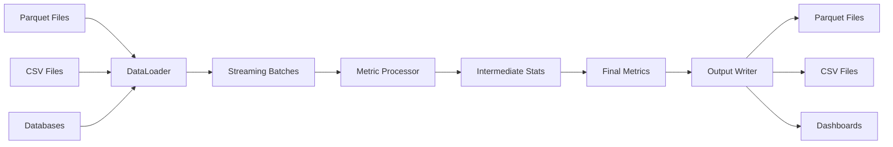
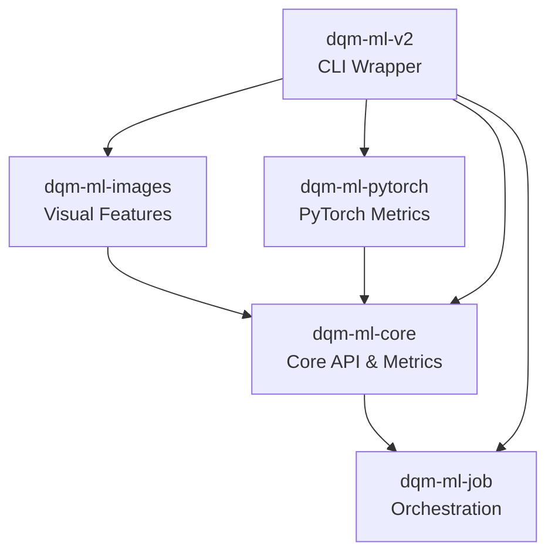

# DQM-ML: Data Quality Metrics for Machine Learning

[![License: Apache 2.0][license-badge]](https://opensource.org/license/apache-2-0)
![Python][python-badge]
![Repo Size][size-badge]

[![CI][github-actions-badge]](https://github.com/Safenai/dqm-ml-workspace/actions)
[![Ruff][ruff-badge]](https://github.com/astral-sh/ruff)
[![uv][uv-badge]](https://github.com/astral-sh/uv)
[![Nox][nox-badge]](https://nox.thea.codes/en/stable/)
[![Checked with mypy][mypy-badge]](https://mypy-lang.org/)

[](https://sonarcloud.io/summary/new_code?id=Safenai_dqm-ml-workspace)
[](https://sonarcloud.io/summary/new_code?id=Safenai_dqm-ml-workspace)

[license-badge]: https://img.shields.io/badge/License-Apache%202.0-brightgreen.svg
[size-badge]: https://img.shields.io/github/repo-size/Safenai/dqm-ml-workspace
[python-badge]: https://img.shields.io/badge/python-3.12%20|%203.13-blue.svg

[github-actions-badge]: https://github.com/Safenai/dqm-ml-workspace/actions/workflows/ci.yml/badge.svg
[uv-badge]: https://img.shields.io/endpoint?url=https://raw.githubusercontent.com/astral-sh/uv/main/assets/badge/v0.json
[nox-badge]: https://img.shields.io/badge/%F0%9F%A6%8A-Nox-D85E00.svg
[ruff-badge]: https://img.shields.io/endpoint?url=https://raw.githubusercontent.com/astral-sh/ruff/main/assets/badge/v2.json
[mypy-badge]: https://www.mypy-lang.org/static/mypy_badge.svg

---

## What is DQM-ML?

DQM-ML (Data Quality Metrics for Machine Learning) is an open-source Python library that helps you assess and quantify the quality of your datasets. Whether you're building ML models, training neural networks, or preparing data for analysis, DQM-ML provides a suite of metrics to measure data completeness, representativeness, and distribution gaps.

Think of it as a **health check for your data** — just like you might check your car's oil or your health vitals, DQM-ML checks your dataset's vital signs before you feed it to your models.

## Why Data Quality Matters

We've all heard the saying "garbage in, garbage out." But how do you *measure* if your data is any good? That's exactly what DQM-ML helps you answer.

Poor data quality can lead to:
- **Biased models** that don't generalize well
- **Unexpected failures** in production
- **Wasted resources** training on bad data
- **Inconsistent results** across different datasets

DQM-ML gives you concrete numbers to work with, so you can make informed decisions about your data before investing in training.

## Key Features

- **Multiple Quality Metrics** — Measure completeness, representativeness, domain gaps, and visual quality
- **Streaming Architecture** — Process datasets larger than available memory without loading everything at once
- **Modular Design** — Install only the components you need
- **Easy to Use** — Simple CLI for quick checks, powerful Python API for integration
- **Extensible** — Add your own metrics or data loaders with the plugin system

## Available on PyPI

Install individual packages based on your needs:

| Package | Description | PyPI |
|---------|-------------|------|
| **dqm-ml-core** | Core API & standard metrics (Completeness, Representativeness) | [![][pypi-core-badge]](https://pypi.org/project/dqm-ml-core/) |
| **dqm-ml-job** | Orchestration, streaming data loaders, and output writers | [![][pypi-pipeline-badge]](https://pypi.org/project/dqm-ml-job/) |
| **dqm-ml-images** | Visual feature extraction from images | [![][pypi-images-badge]](https://pypi.org/project/dqm-ml-images/) |
| **dqm-ml-pytorch** | PyTorch-based metrics (Domain Gap) | [![][pypi-pytorch-badge]](https://pypi.org/project/dqm-ml-pytorch/) |

> **Note:** The `dqm-ml-v2` package is the CLI wrapper. For now, install individual packages above or use the full workspace.

[pypi-core-badge]: https://img.shields.io/pypi/v/dqm-ml-core.svg
[pypi-pipeline-badge]: https://img.shields.io/pypi/v/dqm-ml-job.svg
[pypi-images-badge]: https://img.shields.io/pypi/v/dqm-ml-images.svg
[pypi-pytorch-badge]: https://img.shields.io/pypi/v/dqm-ml-pytorch.svg

## Quick Start

### Installation

```bash
# Install the core package with basic metrics
pip install dqm-ml-core

# Install all packages (core + images + PyTorch + job orchestration)
pip install dqm-ml-core dqm-ml-job dqm-ml-images dqm-ml-pytorch

# Or install the CLI wrapper
pip install dqm-ml-v2
```

### Using the CLI

Run a data quality check from the command line:

```bash
dqm-ml process -p examples/config/completeness.yaml
```

That's it! The CLI reads a simple YAML configuration file and outputs your metrics.

### Using the Python API

Want more control? Use the Python API directly:

```python
import pandas as pd
from dqm_ml_core import CompletenessProcessor

# Create a sample dataset
df = pd.DataFrame({
    "name": ["Alice", "Bob", None, "Diana"],
    "age": [25, 30, 35, None],
    "score": [0.9, 0.8, 0.7, 0.6]
})

# Create and run the completeness processor
processor = CompletenessProcessor(
    name="my_completeness",
    config={"input_columns": ["name", "age", "score"]}
)

# Get the results
result = processor.compute({})
print(f"Overall completeness: {result['overall_completeness']}")
```

### Using the MetricRunner

For quick exploration in a notebook or script:

```python
import pandas as pd
from dqm_ml_core import CompletenessProcessor, MetricRunner

df = pd.DataFrame({"a": [1, 2, None, 4], "b": [5, None, 7, 8]})
runner = MetricRunner()

results = runner.run(df, [CompletenessProcessor(config={"input_columns": ["a", "b"]})])
print(results)
```

> **Tip:** For interactive exploration, check out our [Jupyter notebook example](packages/dqm-ml/examples/multiple_metrics_tests_v2.ipynb).

## Available Metrics

| Metric | What It Measures | Package | When to Use |
|--------|------------------|---------|-------------|
| **Completeness** | Ratio of non-null values | `dqm-ml-core` | Check for missing data |
| **Representativeness** | How well data fits a distribution | `dqm-ml-core` | Validate data distribution |
| **Domain Gap** | Statistical distance between datasets | `dqm-ml-pytorch` | Compare train/test splits |
| **Visual Features** | Image quality indicators | `dqm-ml-images` | Check image dataset quality |

### Completeness

Measures what percentage of your data is present (non-null). Great for finding missing values:

```yaml
metrics_processor:
  completeness:
    type: completeness
    input_columns: [column_a, column_b]
    include_per_column: true
    include_overall: true
```

### Representativeness

Checks if your data follows a known distribution (Normal or Uniform). Useful for:

- Validating synthetic data
- Checking for data drift
- Ensuring balanced datasets

Includes multiple statistical tests:

- **Chi-Square (χ²)** — Goodness-of-fit test for categorical/binned data
- **Kolmogorov-Smirnov (KS)** — Non-parametric test for continuous distributions
- **Shannon Entropy** — Measures information diversity in your data
- **GRTE** (Granular Relative Theoretical Entropy) — Developed in the Confiance.ai program

### Domain Gap

Measures how different two datasets are from each other. Use it to:

- Compare training and test distributions
- Detect data shift over time
- Validate data augmentation

Available metrics:

- **Wasserstein** — Earth mover's distance for distribution comparison
- **MMD** (Maximum Mean Discrepancy) — Kernel-based distribution distance
- **FID** (Fréchet Inception Distance) — Deep learning-based image distance
- **KLMVN** (Kullback-Leibler Multivariate Normal) — KL divergence for Gaussian distributions
- **H-Divergence** — Hypothesis-based divergence measure

### Visual Features

Extracts image quality metrics like:

- **Luminosity** — Brightness level
- **Contrast** — Difference between light and dark
- **Blur** — Sharpness/clarity
- **Entropy** — Information diversity

## Architecture

DQM-ML uses a streaming architecture designed for scalability. Here's how data flows through the system:



**How it works:**

1. **DataLoader** discovers and loads your data (Parquet, CSV, etc.)
2. **Streaming Batches** process data in chunks — never loads the whole dataset into memory
3. **Metric Processor** computes features and intermediate statistics for each batch
4. **Intermediate Stats** accumulate as batches are processed
5. **Final Metrics** aggregate all intermediate stats into dataset-level scores
6. **Output Writer** saves results to your preferred format

## Project Structure

The project is organized as a Python monorepo using UV workspace:

```
dqm-ml-workspace/
├── packages/
│   ├── dqm-ml-core/          # Core API & standard metrics
│   ├── dqm-ml-job/           # Pipeline orchestration & data loaders
│   ├── dqm-ml-images/        # Image feature extraction
│   ├── dqm-ml-pytorch/       # PyTorch-based metrics (Domain Gap)
│   └── dqm-ml-v2/            # CLI wrapper & entry point
├── tests/                    # Test suite
├── docs/                     # Documentation
└── examples/                 # Example configurations
```



**Package breakdown:**

| Package | Purpose |
|---------|---------|
| `dqm-ml-core` | Base classes and core metrics (Completeness, Representativeness) |
| `dqm-ml-job` | Data loading, batch processing, output writing |
| `dqm-ml-images` | Visual feature extraction from images |
| `dqm-ml-pytorch` | Deep learning-based metrics (Domain Gap) |
| `dqm-ml-v2` | CLI entry point and wrapper |

## Configuration

DQM-ML uses YAML configuration files. Here's a complete example:

```yaml
config:
  # Data loading configuration
  dataloaders:
    my_dataset:
      type: parquet
      path: data/my_dataset.parquet
      batch_size: 10000

  # Metrics to compute
  metrics_processor:
    completeness:
      type: completeness
      input_columns: [col1, col2, col3]
      include_per_column: true
      include_overall: true

  # Output configuration
  outputs:
    metrics:
      type: parquet
      path_pattern: output/metrics.parquet
      compression: snappy
```

### Running from a Python Script

You can also run DQM-ML from a Python script by loading a YAML configuration file:

```python
import os
import yaml
from dqm_ml_job.cli import execute

def run_from_config(config_path: str) -> None:
    """Run a data quality job from a YAML configuration file.
    
    Args:
        config_path: Path to the YAML configuration file.
    """
    with open(config_path) as f:
        config = yaml.safe_load(f)
    
    # Execute the job - outputs are saved directly to disk
    execute(config["config"])

if __name__ == "__main__":
    run_from_config("examples/config/completeness.yaml")
```

Find more examples in the `examples/config/` directory.

## Contributing

We welcome contributions! Whether you're fixing a bug, adding a new metric, or improving documentation — help is always appreciated.

### Getting Started

1. **Clone the repository**
   ```bash
   git clone https://github.com/Safenai/dqm-ml-workspace
   cd dqm-ml-workspace
   ```

2. **Install dependencies**
   ```bash
   uv sync
   ```

3. **Install pre-commit hooks**
   ```bash
   uv run pre-commit install
   ```

4. **Run tests**
   ```bash
   uv run nox -s test
   ```

5. **Check linting**
   ```bash
   uv run nox -s lint
   ```

6. **Check spelling**
   ```bash
   uv run nox -s spell
   ```

For detailed guidelines, see [AGENTS.md](./AGENTS.md).

## Documentation

More details are available in our docs:

- **[Architecture & Rationale](./docs/dqm-ml-v2.md)** — Why and how V2 was designed
- **[Metrics Guide](./docs/metrics.md)** — Available metrics and configurations
- **[Configuration Guide](./docs/configuration.md)** — Writing pipeline configs
- **[Roadmap & Limitations](./docs/ROADMAP.md)** — Known issues and planned evolutions
- **[Contributing Guide](./docs/contributing.md)** — Development setup

## License

DQM-ML is licensed under the Apache 2.0 License. See [LICENSE](https://opensource.org/license/apache-2-0) for details.

## Origins

DQM-ML was originally developed as part of the **[Confiance.ai](https://www.confiance.ai/)** research program, which focused on trustworthy AI for industry. The library was inspired by academic research and real-world industrial needs.

For more technical and scientific details, refer to:

- **[HAL Publication](https://hal.science/hal-04719346v1)** — Academic paper describing the methodology
- **[Scientific Deliverable](https://catalog.confiance.ai/records/p46p6-1wt83/files/Scientific_Contribution_For_Data_quality_assessment_metrics_for_Machine_learning_process-v2.pdf)** — Detailed technical documentation

```bibtex
@proceedings{chaouche2024dqm,
  title={DQM: Data Quality Metrics for AI components in the industry},
  author={Chaouche, Sabrina and Randon, Yoann and Adjed, Faouzi and Boudjani, Nadira and Khedher, Mohamed Ibn},
  booktitle={Proceedings of the AAAI Symposium Series},
  volume={4},
  number={1},
  pages={24--31},
  year={2024}
}
```

## Links

- **PyPI**: [dqm-ml-core](https://pypi.org/project/dqm-ml-core/), [dqm-ml-job](https://pypi.org/project/dqm-ml-job/), [dqm-ml-images](https://pypi.org/project/dqm-ml-images/), [dqm-ml-pytorch](https://pypi.org/project/dqm-ml-pytorch/)
- **Documentation**: https://safenai.github.io/dqm-ml-workspace
- **Repository**: https://github.com/Safenai/dqm-ml-workspace

---

<p align="center">
  <sub>Built with ❤️ by the DQM-ML community</sub>
</p>
