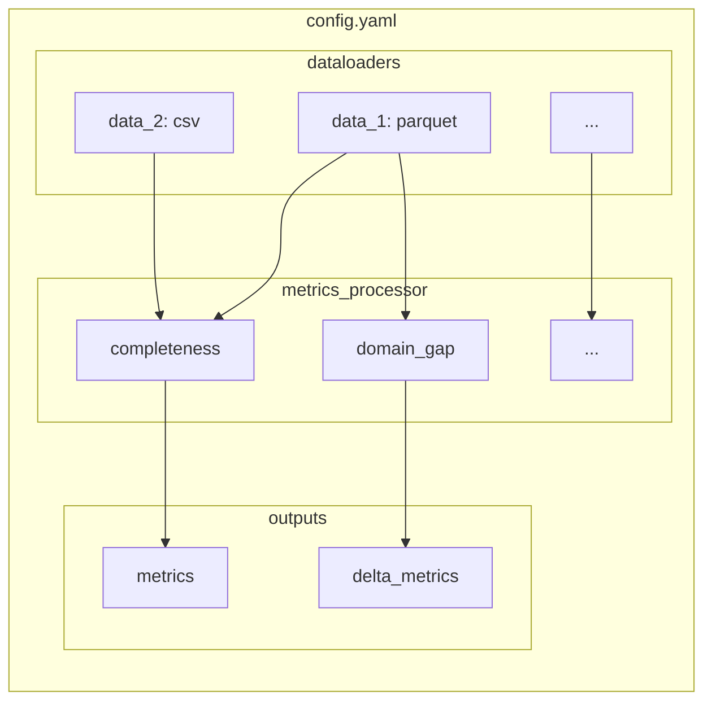

# Configuration Guide

DQM-ML pipelines are configured using **YAML** files. This guide explains how to write configuration files that tell DQM-ML where to find data, which metrics to compute, and where to save results.

## Quick Links

- [YAML Basics](yaml_basics.md) - Quick reference for YAML syntax
- [Data Loaders](dataloaders.md) - Define data sources and selections
- [Metrics Computation](metrics_computation.md) - How metrics are computed
- [CLI Reference](cli.md) - Command-line interface

## Configuration Structure Overview



**Configuration has 3 main sections:**

| Section | Description |
|---------|-------------|
| `dataloaders` | Where to load data from (files, filters, splits) |
| `metrics_processor` | Which metrics to compute |
| `outputs` | Where to save results |

## Configuration Structure

A DQM-ML config has three main sections:

### 1. `dataloaders` - Where's the data?

Defines where your data comes from. You can define multiple data sources.

```yaml
dataloaders:
  # Give your data a memorable name
  my_training_data:
    # Use "parquet" for .parquet files, "csv" for .csv files
    type: parquet
    # Path to the file (relative paths work too!)
    path: "data/train.parquet"
    # Optional: batch size for processing (default: 10000)
    batch_size: 5000
```

### 2. `metrics_processor` - What to compute

Defines which metrics or feature extractors to run on your data.

```yaml
metrics_processor:
  # Give each metric a unique name
  null_check:
    # The type of metric (from the registry)
    type: completeness
    # Which columns to analyze
    input_columns: ["age", "income", "email"]
    # Include per-column scores?
    include_per_column: true
    # Include overall score?
    include_overall: true

  image_quality:
    type: visual_metric
    input_columns: ["image_bytes"]
```

### 3. `outputs` - Where to save results

Defines where to save generated features (optional - if omitted, only metrics are saved).

```yaml
outputs:
  feature_output:
    type: parquet
    # Where to save
    path: "output/enriched_data.parquet"
    # Which columns to include (original + generated)
    columns: ["sample_id", "m_luminosity", "m_blur_level"]
```

## Complete Example

Here's a full configuration file that does something useful:

```yaml
dataloaders:
  train_data:
    type: parquet
    path: "data/train.parquet"
    batch_size: 10000

metrics_processor:
  # Check for missing values
  completeness:
    type: completeness
    input_columns: ["age", "income", "zip_code"]
    include_per_column: true
    include_overall: true

  # Extract image features
  visual:
    type: visual_metric
    input_columns: ["image_data"]
    grayscale: true

outputs:
  save_results:
    type: parquet
    path: "output/enriched_data.parquet"
    columns: ["sample_id", "m_luminosity", "m_contrast"]
```

See [Data Loaders](dataloaders.md) for detailed documentation on:
- Single selection (full dataset)
- Filtered selection (`filter:` config)
- Split selection (`split_by:` + `split_values:` config)
- Selection names

## Metrics Processor

Defines which metrics or feature extractors to run on your data.

```yaml
metrics_processor:
  # Give each metric a unique name
  null_check:
    # The type of metric (from the registry)
    type: completeness
    # Which columns to analyze
    input_columns: ["age", "income", "email"]
    # Include per-column scores?
    include_per_column: true
    # Include overall score?
    include_overall: true
```

See [Metrics Computation](metrics_computation.md) for detailed documentation on:
- Per-selection metrics
- Delta metrics (pairwise comparisons)
- Which metrics support delta
- Output file formats

## Output Files

Defines where to save generated metrics and features.

```yaml
outputs:
  feature_output:
    type: parquet
    # Where to save
    path: "output/enriched_data.parquet"
    # Which columns to include (original + generated)
    columns: ["sample_id", "m_luminosity", "m_blur_level"]
```

See [Metrics Computation](metrics_computation.md) for detailed documentation on:
- Per-selection output format
- Delta output format
- Filename patterns

## Running Your Configuration

Once you've written your config file, run it with the `-p` (or `--path-config`) flag:

```bash
uv run dqm-ml process -p my_config.yaml
```

That's it! DQM-ML will:
1. Load your data in batches
2. Run the metrics you specified
3. Save results to the output location

## Choosing Your Data Format

| Format | Best For | Limitations |
|--------|----------|-------------|
| **Parquet** | Large datasets, columnar data, analytics | Not human-readable |
| **CSV** | Small datasets, interoperability | Slower, larger files |
| **Protobuf** | Streaming, schema evolution | Requires schema definition |

### Recommendation

- **< 1 GB**: CSV is fine
- **> 1 GB**: Use Parquet for speed and memory efficiency
- **Production pipelines**: Parquet with compression

## Batch Size Guide

How to choose the right batch size:

| Data Size | Recommended Batch Size | Why |
|-----------|------------------------|-----|
| **< 100 MB** | 10,000 | Default works well |
| **100 MB - 1 GB** | 10,000 - 50,000 | Balance memory/performance |
| **1 - 10 GB** | 50,000 - 100,000 | Larger batches more efficient |
| **> 10 GB** | 100,000+ | Adjust based on available RAM |

> **Tip:** Start with the default (10,000) and increase if you have plenty of RAM. The smaller the batch, the more overhead.

## Production vs Development

For production environments, consider:

- **Environment variables**: Set `DQM_ML_BATCH_SIZE` to override config
- **Monitoring**: Add logging to track metric computation time
- **Error handling**: Use `try/except` around `execute()` for graceful failures

For development:

- Use smaller sample data to iterate faster
- Enable debug logging with `logging.basicConfig(level=logging.DEBUG)`

## Common Patterns

### Running Multiple Metrics

```yaml
metrics_processor:
  completeness_check:
    type: completeness
    input_columns: ["col_a", "col_b"]
  
  representativeness_check:
    type: representativeness
    input_columns: ["feature_x", "feature_y"]
    distribution: "normal"
```

### Using split_by for Multiple Selections

Instead of defining multiple dataloaders, use `split_by` to create multiple selections from a single source:

```yaml
dataloaders:
  data:
    type: parquet
    path: "data/all.parquet"
    split_by: dataset
    split_values: [train, test]

metrics_processor:
  completeness:
    type: completeness
    input_columns: ["col_a"]
```

This creates `data_train` and `data_test` selections, and computes completeness for both in one run.
