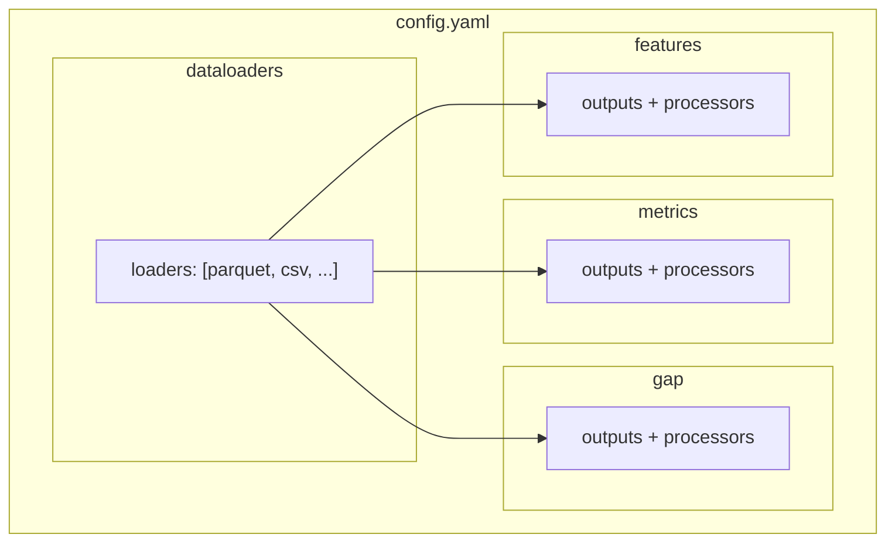

# Configuration Guide

DQM-ML pipelines are configured using **YAML** files. This guide explains how to write configuration files that tell DQM-ML where to find data, which metrics to compute, and where to save results.

## Configuration Structure Overview



Configuration has 4 main sections, documented here in order of concern:

| # | Section | What it does | Who configures it |
|---|---------|-------------|-------------------|
| 1 | `features`, `metrics`, `gap` | **Interfaces** — what to compute | Data quality team, data scientists |
| 2 | `processors` (under each interface) | **Processors** — how to configure computation | Data scientists |
| 3 | `dataloaders` | **Data Selection** — where data comes from | Data engineers |
| 4 | `storage`, `compute`, `errors` (global) | **Global Configuration** — execution environment | DevOps |

The pipeline execution order is different from the authoring order: data loaders feed batches into each interface's processors. The sections below are ordered by **what you need to decide first** when writing a config.

- [Interfaces](interfaces.md) — Interface configuration and outputs
- [Processors](processors.md) — Common processor structure and columns
- [Features](features.md) — Features processors
- [Metrics](metrics.md) — Metrics processors
- [Gap](gap.md) — Gap processors
- [Data Selection](data_selection.md) — Detailed data source configuration
- [Global Configuration](global.md) — Storage, compute, and error settings

> **Tip:** For a complete working example with every section populated, see `examples/config/config_v2.yaml`.

## Schema Validation

The configuration follows a [JSON Schema](../schema/config.json) defined at `docs/schema/config.json`. Use it in your IDE for autocompletion and validation:

```yaml
# yaml-language-server: $schema=../../docs/schema/config.json

your_key: value
```

## Quick Links

- [CLI Reference](../cli.md) — Command-line interface
- [YAML Basics](../yaml_basics.md) — Quick reference for YAML syntax
- [Formal and Core Concepts](../formal_concepts.md) for definitions of **Sample**, **Metric**, **Data Selection**, **Batch**, and related terminology.
