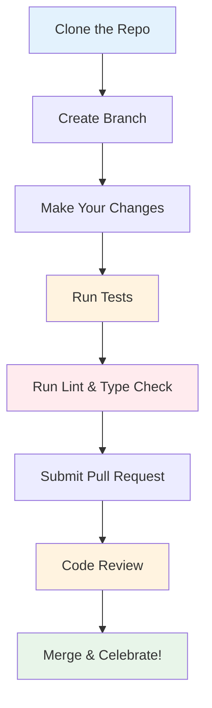

# Contributing to DQM-ML

We welcome contributions! Whether you're fixing a bug, adding a new **Metric**, or improving documentation, your help makes DQM-ML better for everyone.

> **See also:** [Concepts](formal_concepts.md) for definitions of **Metric**, **Batch Metric**, **Processor**, and related terminology used throughout this page.

This guide walks you through setting up your development environment and adding new features.

## What Can You Contribute?

### Non-Code Contributions

You don't need to write code to contribute to DQM-ML!

- 💡 **Ideas** - Open an issue with your suggestions
- 📖 **Documentation** — Improve existing docs, fix typos, translate
- 🧪 **Testing** — Report bugs, test on different platforms, suggest edge cases, review PRs
- 💬 **Community** — Ask or answer questions in discussions, share your use case, write a post on social networks
- 🎨 **Design** — Create logos, graphics for documentation

### Code Contributions

- 🐛 **Bug fixes** - Found an issue? Let us know, and maybe fix it too!
- 📊 **New metrics** - Add completeness, representativeness, or domain gap calculations
- 🔌 **New plugins** - Add a custom DataLoader or OutputWriter for your own use case
- 📝 **Examples & tutorials** - Add example scripts or notebooks showing DQM-ML usage
- 🧪 **Better tests** - Make the project more robust
- 🎨 **Website & docs design** - Improve mkdocs config, CSS, theme, documentation layout, mermaid diagrams

## Code Contribution Workflow



## Prerequisite

## Development Environment Setup

We use:
- [uv](https://github.com/astral-sh/uv) for fast development and workspace management
- [mise](https://mise.jdx.dev/) for common development tasks

### 1. Prerequisites

Install mise

```bash
curl -fsSL https://mise.run | bash
# Make sure mise is on your PATH (e.g. ~/.local/bin)
export PATH="$HOME/.local/bin:$PATH"
````

[cspell](https://cspell.org/) depends on the [hunspell](https://github.com/hunspell/hunspell) C extension:

```bash
sudo apt install libhunspell-dev
```


```bash
# Clone the repository
git clone https://github.com/Safenai/dqm-ml-workspace
cd dqm-ml-workspace

# Install uv if you haven't already
curl -LsSf https://astral.sh/uv/install.sh | sh
```

### 2. Initialize Workspace

```bash
# This installs all dependencies
uv sync
```

### 3. Install Pre-commit Hooks

```bash
# Runs checks before every commit
uv run pre-commit install
```

## Quality Standards

Before submitting a PR, please ensure all checks pass:

```bash
mise code_quality   # Lint (ruff) + type check (pyright)
mise spell          # Spell check (cspell)
mise test           # Test with coverage
mise complexity     # Code complexity (complexipy, max McCabe 15)
mise mkdocs_offline
```

All checks run via [mise](https://mise.jdx.dev/).
Tasks are defined in `.mise.toml`.

You can select tests with pytest options:

```bash
mise test_custom -- <args>   # Run specific tests with custom args
# Example to run only 1 test
mise test_custom -- -k test_representativeness
```

### Spell check

Then run:

```bash
mise spell
```

### Complexity

Uses [complexipy](https://pypi.org/project/complexipy/) to enforce max McCabe complexity of 15 across `packages/`:

```bash
mise complexity
```

And tests complexity:

```bash
mise test_complexity
```

## Adding Processors & Plugins

DQM-ML defines three processor interfaces — **Metrics**, **Features**, and **Gap** — plus plugins for **DataLoaders** and **OutputWriters**. Each has its own base class and entry point registration.

The package READMEs provide detailed step-by-step guides:

| What to add | Guide |
|-------------|-------|
| **Metrics Processor** | [`dqm-ml-core/README.md`](../packages/dqm-ml-core/README.md#for-developers) |
| **Features Processor** (Visual) | [`dqm-ml-images/README.md`](../packages/dqm-ml-images/README.md#adding-a-custom-feature) |
| **Features Processor** (Embeddings) | [`dqm-ml-pytorch/README.md`](../packages/dqm-ml-pytorch/README.md#features-processors) |
| **Gap Processor** | [`dqm-ml-pytorch/README.md`](../packages/dqm-ml-pytorch/README.md#adding-a-custom-gap-metric) |
| **DataLoader** plugin | [`dqm-ml-job/README.md`](../packages/dqm-ml-job/README.md#adding-a-custom-dataloader) |
| **OutputWriter** plugin | [`dqm-ml-job/README.md`](../packages/dqm-ml-job/README.md#adding-a-custom-outputwriter) |

## Add Tests

Create a test file in the `tests/` directory. Use existing tests as templates.

See [Testing Strategy](#testing-strategy) for the full breakdown of test categories, fixtures, and conventions.

## Submit changes for review

**Step 1: Create a Branch**

```bash
git checkout -b your-feature-name
```

**Step 2: Make Your Changes**

Follow the [quality standards](#quality-standards) below.

**Step 3: Submit a Pull Request**

1. Push: `git push origin your-feature-name`
2. Copy paste the link in the terminal into your browser
3. Select dev branch instead of main (default)
4. Click "Compare & pull request"
5. Fill out the PR template
6. Submit!
7. Reviewers will read your submission

**Tips for First-Timers**

- Start with documentation improvements (easier to review)
- Don't worry about making mistakes — we all started somewhere
- Ask questions in the PR if you're unsure
- It's okay if your first PR takes a few attempts

## Best Practices

Following these patterns keeps the codebase consistent:

| Practice | Why it matters |
|----------|----------------|
| **Streaming-friendly** | Keep `compute_batch_metric` lightweight - only compute what's needed for final aggregation |
| **Use PyArrow** | Ensures compatibility with the rest of the pipeline |
| **Add docstrings** | Helps others understand and use your metric |
| **Write tests** | Keeps bugs from being introduced |

### Good Docstring Example

```python
def compute(self, batch_metrics: dict | None = None) -> dict[str, pa.Array]:
    """Compute final dataset-level metric from batch statistics.

    Args:
        batch_metrics: Dictionary of aggregated batch statistics.

    Returns:
        Dictionary containing the final metric values.

    Raises:
        ValueError: If `batch_metrics` is empty or missing required keys.
    """
    # Your code here
```

## Testing Strategy

This section describes how tests are organized in DQM-ML and how to add new tests.

### Test Organization

```mermaid
flowchart TB

    subgraph "Test Types"
  
        U[Unit Tests<br/>tests/unit]
        I[Integration Tests<br/>tests/integration]
        C[CLI Tests<br/>tests/cli]
        B[Benchmark Tests<br/>tests/benchmark]
    end
    
    subgraph "Test Pyramid"
        TP[Unit Tests - Fast, isolated<br/>Core logic, processors]
        TI[Integration Tests - Real data<br/>Pipelines, loaders, metrics]
        TC[CLI Tests - End-to-end<br/>Commands, config files]
    end
    
    U --> TP
    I --> TI
    C --> TC

    F[Fixtures - Shared test data<br/>tests/fixtures/ and tests/integration/fixtures/]
    TP --> F
    TI --> F
    B --> F

    B -.-> BN[Compares v1 (IRT-SystemX/dqm-ml)<br/>and v2 (this repo) metric values<br/>on open-source datasets]
```

### Test Directory Structure

```
tests/
├── conftest.py              # Pytest configuration & fixture imports
├── fixtures/                # Shared cross-test fixtures
│   ├── cli_fixtures.py     # CLI environment fixtures
│   ├── stress_images.py    # Stress test image generators
│   └── test_fixtures.py    # Generic test fixtures (mock data, temp paths)
├── utils/                   # Utility functions for tests
│   ├── files.py            # File handling helpers
│   ├── jobs.py             # Job configuration helpers
│   ├── pipeline_configs.py # Pipeline config builders
│   └── plots.py            # Visualization helpers
├── unit/                    # Unit tests (fast, isolated)
│   ├── core/               # Core API tests (data_processor, metric_runner)
│   ├── pipeline/           # Pipeline tests (loaders, writers)
│   └── v2/                 # CLI wrapper tests
├── integration/             # Integration tests (synthetic data)
│   ├── fixtures/           # Integration-specific fixtures and data
│   │   ├── config.py      # Configuration fixtures
│   │   ├── data.py        # Data fixtures
│   │   ├── jobs.py        # Job configuration fixtures
│   │   └── paths.py       # Path fixtures
│   ├── test_completeness.py
│   ├── test_representativeness.py
│   ├── test_domain_gap.py
│   ├── test_visual_features.py
│   └── test_pandas_welding.py
├── benchmark/               # Benchmark tests (record metric values)
│   └── test_benchmark_domain_gap.py
└── cli/                     # CLI end-to-end tests
    ├── test_v2_wrapper.py
    └── test_job_cli.py
```

### Test Fixtures

DQM-ML uses pytest fixtures for reusable test data. Here's what's available:

| Fixture | Scope | Purpose | Usage |
|---------|-------|---------|-------|
| `test_path` | session | Tests directory path | All test files |
| `output_path` | session | Output directory for test results | Integration tests |
| `coco_data` | session | COCO dataset for domain gap tests | `test_domain_gap.py` |
| `normal_dist` | function | Normal distribution sample | Representativeness tests |
| `not_normal_dist` | function | Non-normal distribution | Statistical tests |
| `uniform_dist` | function | Uniform distribution | Statistical tests |
| `not_uniform_dist` | function | Non-uniform distribution | Statistical tests |
| `job_completeness` | function | Completeness job config | Pipeline tests |
| `job_representativeness` | function | Representativeness job config | Pipeline tests |
| `job_domain_gap` | function | Domain gap job config | Pipeline tests |
| `job_visual_features` | function | Visual features job config | Pipeline tests |
| `all_classes` | session | All available pipeline classes | CLI tests |
| `coco_data_dir` | session | Path to COCO data directory | Benchmark tests |
| `coco_parquet_path` | session | Path to COCO parquet file | Benchmark tests |
| `mock_parquet_dataset` | function | Small mock Parquet dataset | Unit tests |
| `sample_dataframe` | function | Small sample DataFrame | Unit tests |
| `temp_output_path` | function | Temporary output directory | All test types |

**Example using fixtures**:

```python
import pytest

def test_completeness_with_data(
    test_path: str,
    uniform_dist: Any
) -> None:
    """Test completeness metric with uniform distribution."""
    processor = CompletenessProcessor(
        name="test",
        config={"columns": {"input": ["feature"]}}
    )
    result = processor.compute({})
    assert result is not None
```

### Running Tests

```bash
# All tests with coverage report
uv run nox -s test

# Fast mode (skip slow tests)
uv run pytest -m "not slow"

# Specific test file
uv run pytest tests/integration/test_completeness.py

# With verbose output
uv run pytest -v tests/

# Run only unit tests
uv run pytest tests/unit/

# Run with coverage for specific package
uv run pytest --cov=packages/dqm-ml-core tests/
```

### Adding a New Test

1. **Choose test type**:
   - **Unit tests**: `tests/unit/package_name/` - fast, isolated tests of classes and functions
   - **Integration tests**: `tests/integration/` - tests that call `dqm-ml process` with YAML configs on synthetic data
   - **CLI tests**: `tests/cli/` - end-to-end tests of command-line usage
   - **Benchmark tests**: `tests/benchmark/` - compute metrics on open-source datasets (COCO) to compare metric values between [v1](https://github.com/IRT-SystemX/dqm-ml) and v2 (this repo); no pass/fail assertions, records results for manual inspection

2. **Follow naming conventions**:
   - Test files: `test_*.py`
   - Test functions: `test_*`
   - Use descriptive names: `test_completeness_returns_valid_score`

3. **Use existing fixtures**:
   ```python
   def test_my_feature(test_path: str, uniform_dist: Any) -> None:
       # Your test code using fixtures
       pass
   ```

4. **Mark slow tests** (if your test takes >30s):
   ```python
   @pytest.mark.slow
   def test_slow_operation() -> None:
       # This test will be skipped with -m "not slow"
       pass
   ```

### Test Data Sources

| Type | Source | When to Use |
|------|--------|--------------|
| **Synthetic** | Generated via fixtures (normal_dist, uniform_dist) | Most unit/integration tests |
| **Real datasets** | COCO-2017 via `fiftyone.zoo` | Domain gap tests |
| **Example data** | `examples/config/` | CLI tests |

### Test Coverage & Results

After running tests, reports are generated:

| Report | Location | Description |
|--------|----------|-------------|
| Coverage HTML | `docs/reports/htmlcov/index.html` | Line-by-line coverage |
| Test Results HTML | `docs/reports/pytest/pytest_report.html` | Test execution report |

### CI/CD Testing

Tests run automatically on every push via GitHub Actions:

- **Lint**: Code style with ruff
- **Type Check**: Type safety with mypy
- **Test**: Full test suite with pytest
- **Docs**: Documentation build

See the [README](https://github.com/anomalyco/dqm-ml-workspace#readme) for current status badges.

## Getting Help

- 📖 Check the [Documentation](https://safenai.github.io/dqm-ml-workspace/) - Start here!
- 💬 Open an [Issue](https://github.com/Safenai/dqm-ml-workspace/issues) - For bugs or features
- 💭 Start a [Discussion](https://github.com/Safenai/dqm-ml-workspace/discussions) - For questions
- ⭐ Star us on [GitHub](https://github.com/Safenai/dqm-ml-workspace) - Motivate the team!

Thanks for considering contributing to DQM-ML!
