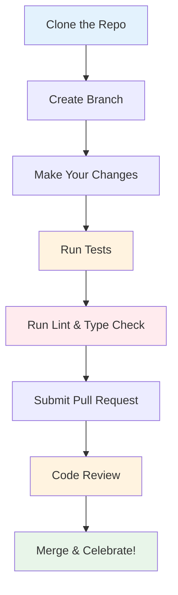

# Contributing to DQM-ML

We welcome contributions! Whether you're fixing a bug, adding a new metric, or improving documentation, your help makes DQM-ML better for everyone.

This guide walks you through setting up your development environment and adding new features.

## What Can You Contribute?

- 🐛 **Bug fixes** - Found an issue? Let us know and potentially fix it!
- 📊 **New metrics** - Add completeness, representativeness, or domain gap calculations
- 📝 **Documentation** - Improve docs, add examples, translate
- 🎨 **Better tests** - Increase test coverage, add edge cases
- 💡 **Ideas** - Open an issue with your suggestions

## Quick Start



## Development Environment Setup

We use [uv](https://github.com/astral-sh/uv) for fast development and workspace management.

### 1. Prerequisites

```bash
# Clone the repository
git clone https://github.com/Safenai/dqm-ml-workspace
cd dqm-ml-workspace

# Install uv if you haven't already
curl -LsSf https://astral.sh/uv/install.sh | sh

# Install git-lfs for large test files
sudo apt-get install git-lfs
git lfs pull

# Initialize submodules (for legacy dqm-ml comparison)
git submodule update --init --recursive
```

### 2. Initialize Workspace

```bash
# This installs all dependencies
uv sync
```

### 3. Install Pre-commit Hooks

```bash
# Runs checks before every commit
uv run pre-commit install
```

## Quality Standards

Before submitting a PR, please ensure all checks pass:

```bash
# Run all quality checks
uv run nox

# Or run individual checks:
uv run nox -s test       # Run tests
uv run nox -s lint       # Check code style
uv run nox -s lint_fix   # Auto-fix style issues
uv run nox -s type_check # Type checking
uv run nox -s docs       # Build documentation
```

## Adding a New Metric

Here's how to add your own metric to DQM-ML:

### 1. Create the Processor Class

Inherit from `DatametricProcessor` and implement the required methods:

```python
from dqm_ml_core.api.data_processor import DatametricProcessor
import pyarrow as pa

class MyNewMetric(DatametricProcessor):
    """A brief description of what this metric measures."""

    def compute_features(self, batch, prev_features=None):
        """
        Extract features from raw data.
        Optional: compute per-sample features.
        """
        return {}  # Return dict of feature arrays

    def compute_batch_metric(self, features):
        """Compute intermediate statistics for one batch."""
        # Example: count non-null values
        return {"count": pa.array([len(features)]), "sum": pa.array([...])}

    def compute(self, batch_metrics=None):
        """Aggregate batch results into final metric."""
        # Compute final score from accumulated batch stats
        return {"my_metric_score": pa.array([0.95])}

    def compute_delta(self, source, target):
        """Optional: Compare two datasets."""
        return {"delta_score": pa.array([...])}
```

### 2. Register via Entry Points

Add this to your package's `pyproject.toml`:

```toml
[project.entry-points."dqm_ml.metrics"]
my_new_metric = "my_package:MyNewMetric"
```

### 3. Add Tests

Create a test file in the `tests/` directory. Use existing tests as templates.

## Non-Code Contributions

You don't need to write code to contribute to DQM-ML!

**Documentation**

- Improve existing docs
- Add examples and tutorials
- Fix typos and improve clarity
- Translate documentation

**Testing**

- Report bugs you find
- Test on different platforms
- Suggest edge cases we haven't covered
- Review pull requests

**Community**

- Answer questions in discussions
- Share your use case
- Write blog posts or tutorials
- Speak at meetups or conferences

**Design**

- Suggest UI improvements for CLI
- Design better documentation layouts
- Create logos or graphics

## Submit changes for review

**Step 1: Create a Branch**

```bash
git checkout -b your-feature-name
```

**Step 2: Make Your Changes**

Follow the [quality standards](#quality-standards) below.

**Step 3: Submit a Pull Request**

1. Push: `git push origin your-feature-name`
2. Copy paste the link in the terminal into your browser
3. Select dev branch instead of main (default)
4. Click "Compare & pull request"
5. Fill out the PR template
6. Submit!
7. Reviewers will read your submission

**Tips for First-Timers**

- Start with documentation improvements (easier to review)
- Don't worry about making mistakes — we all started somewhere
- Ask questions in the PR if you're unsure
- It's okay if your first PR takes a few attempts

## Best Practices

Following these patterns keeps the codebase consistent:

| Practice | Why it matters |
|----------|----------------|
| **Streaming-friendly** | Keep `compute_batch_metric` lightweight - only compute what's needed for final aggregation |
| **Use PyArrow** | Ensures compatibility with the rest of the pipeline |
| **Add docstrings** | Helps others understand and use your metric |
| **Write tests** | Keeps bugs from being introduced |

### Good Docstring Example

```python
def compute(self, batch_metrics: dict | None = None) -> dict[str, pa.Array]:
    """Compute final dataset-level metric from batch statistics.

    Args:
        batch_metrics: Dictionary of aggregated batch statistics.

    Returns:
        Dictionary containing the final metric values.
    """
    # Your code here
```

## Getting Help

- 📖 Check the [Documentation](https://safenai.github.io/dqm-ml-workspace/) - Start here!
- 💬 Open an [Issue](https://github.com/Safenai/dqm-ml-workspace/issues) - For bugs or features
- 💭 Start a [Discussion](https://github.com/Safenai/dqm-ml-workspace/discussions) - For questions
- ⭐ Star us on [GitHub](https://github.com/Safenai/dqm-ml-workspace) - Motivate the team!

Thanks for considering contributing to DQM-ML!
