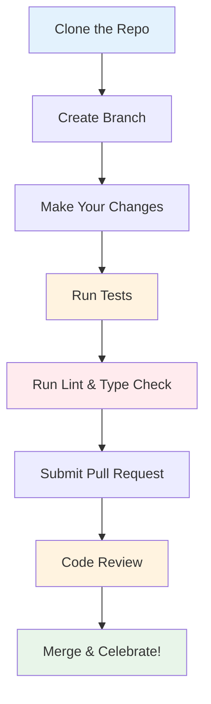

# Contributing to DQM-ML

We welcome contributions! Whether you're fixing a bug, adding a new **Metric**, or improving documentation, your help makes DQM-ML better for everyone.

> **See also:** [Concepts](formal_concepts.md) for definitions of **Metric**, **Batch Metric**, **Processor**, and related terminology used throughout this page.

This guide walks you through setting up your development environment and adding new features.

## What Can You Contribute?

### Non-Code Contributions

You don't need to write code to contribute to DQM-ML!

- 💡 **Ideas** - Open an issue with your suggestions
- 📖 **Documentation** — Improve existing docs, fix typos, translate
- 🧪 **Testing** — Report bugs, test on different platforms, suggest edge cases, review PRs
- 💬 **Community** — Ask or answer questions in discussions, share your use case, write a post on social networks
- 🎨 **Design** — Create logos, graphics for documentation

### Code Contributions

- 🐛 **Bug fixes** - Found an issue? Let us know, and maybe fix it too!
- 📊 **New metrics** - Add completeness, representativeness, or domain gap calculations
- 🔌 **New plugins** - Add a custom DataLoader or OutputWriter for your own use case
- 📝 **Examples & tutorials** - Add example scripts or notebooks showing DQM-ML usage
- 🧪 **Better tests** - Make the project more robust
- 🎨 **Website & docs design** - Improve mkdocs config, CSS, theme, documentation layout, mermaid diagrams

## Code Contribution Workflow



## Prerequisite

## Development Environment Setup

We use:
- [uv](https://github.com/astral-sh/uv) for fast development and workspace management
- [mise](https://mise.jdx.dev/) for common development tasks

### 1. Prerequisites

Install mise

```bash
curl -fsSL https://mise.run | bash
# Make sure mise is on your PATH (e.g. ~/.local/bin)
export PATH="$HOME/.local/bin:$PATH"
````

[cspell](https://cspell.org/) depends on the [hunspell](https://github.com/hunspell/hunspell) C extension:

```bash
sudo apt install libhunspell-dev
```


```bash
# Clone the repository
git clone https://github.com/Safenai/dqm-ml-workspace
cd dqm-ml-workspace

# Install uv if you haven't already
curl -LsSf https://astral.sh/uv/install.sh | sh
```

### 2. Initialize Workspace

```bash
# This installs all dependencies
uv sync
```

### 3. Install Pre-commit Hooks

```bash
# Runs checks before every commit
uv run pre-commit install
```

## Quality Standards

Before submitting a PR, please ensure all checks pass:

```bash
mise code_quality   # Lint (ruff) + type check (pyright)
mise spell          # Spell check (cspell)
mise test           # Test with coverage
mise complexity     # Code complexity (complexipy, max McCabe 15)
mise mkdocs_offline
```

All checks run via [mise](https://mise.jdx.dev/).
Tasks are defined in `.mise.toml`.

### Documentation

```bash
mise mkdocs_offline            # Build docs for offline use (opens site/index.html)
uv run nox -s docs_serve       # Serve docs locally with live reload
uv run nox -s docs_serve -- -a 0.0.0.0:8001  # Serve on a custom port
```

You can select tests with pytest options:

```bash
mise test_custom -- <args>   # Run specific tests with custom args
# Example to run only 1 test
mise test_custom -- -k test_representativeness
```

### Spell check

Then run:

```bash
mise spell
```

### Complexity

Uses [complexipy](https://pypi.org/project/complexipy/) to enforce max McCabe complexity of 15 across `packages/`:

```bash
mise complexity
```

And tests complexity:

```bash
mise test_complexity
```

## Adding Processors & Plugins

DQM-ML defines three processor interfaces — **Metrics**, **Features**, and **Gap** — plus plugins for **DataLoaders** and **OutputWriters**. Each has its own base class and entry point registration.

The package READMEs provide detailed step-by-step guides:

| What to add | Guide |
|-------------|-------|
| **Metrics Processor** | [`dqm-ml-core/README.md`](../packages/dqm-ml-core/README.md#for-developers) |
| **Features Processor** (Visual) | [`dqm-ml-images/README.md`](../packages/dqm-ml-images/README.md#adding-a-custom-feature) |
| **Features Processor** (Embeddings) | [`dqm-ml-pytorch/README.md`](../packages/dqm-ml-pytorch/README.md#features-processors) |
| **Gap Processor** | [`dqm-ml-pytorch/README.md`](../packages/dqm-ml-pytorch/README.md#adding-a-custom-gap-metric) |
| **DataLoader** plugin | [`dqm-ml-job/README.md`](../packages/dqm-ml-job/README.md#adding-a-custom-dataloader) |
| **OutputWriter** plugin | [`dqm-ml-job/README.md`](../packages/dqm-ml-job/README.md#adding-a-custom-outputwriter) |

## Add Tests

Create a test file in the `tests/` directory. Use existing tests as templates.

See [Testing Strategy](testing.md) for the full breakdown of test categories, fixtures, and conventions. See [Packaging Tests](packaging-tests.md) for verifying package isolation.

## Submit changes for review

**Step 1: Create a Branch**

```bash
git checkout -b your-feature-name
```

**Step 2: Make Your Changes**

Follow the [quality standards](#quality-standards) below.

**Step 3: Submit a Pull Request**

1. Push: `git push origin your-feature-name`
2. Copy paste the link in the terminal into your browser
3. Select dev branch instead of main (default)
4. Click "Compare & pull request"
5. Fill out the PR template
6. Submit!
7. Reviewers will read your submission

**Tips for First-Timers**

- Start with documentation improvements (easier to review)
- Don't worry about making mistakes — we all started somewhere
- Ask questions in the PR if you're unsure
- It's okay if your first PR takes a few attempts

## Best Practices

Following these patterns keeps the codebase consistent:

| Practice | Why it matters |
|----------|----------------|
| **Streaming-friendly** | Keep `compute_batch_metric` lightweight - only compute what's needed for final aggregation |
| **Use PyArrow** | Ensures compatibility with the rest of the pipeline |
| **Add docstrings** | Helps others understand and use your metric |
| **Write tests** | Keeps bugs from being introduced |

### Good Docstring Example

```python
def compute(self, batch_metrics: dict | None = None) -> dict[str, pa.Array]:
    """Compute final dataset-level metric from batch statistics.

    Args:
        batch_metrics: Dictionary of aggregated batch statistics.

    Returns:
        Dictionary containing the final metric values.

    Raises:
        ValueError: If `batch_metrics` is empty or missing required keys.
    """
    # Your code here
```

## Testing Strategy

See [Testing](testing.md) for the full breakdown of test categories, fixtures, running tests, and adding new tests. See [Packaging Tests](packaging-tests.md) for verifying package isolation.

## Getting Help

- 📖 Check the [Documentation](https://safenai.github.io/dqm-ml-workspace/) - Start here!
- 💬 Open an [Issue](https://github.com/Safenai/dqm-ml-workspace/issues) - For bugs or features
- 💭 Start a [Discussion](https://github.com/Safenai/dqm-ml-workspace/discussions) - For questions
- ⭐ Star us on [GitHub](https://github.com/Safenai/dqm-ml-workspace) - Motivate the team!

Thanks for considering contributing to DQM-ML!
