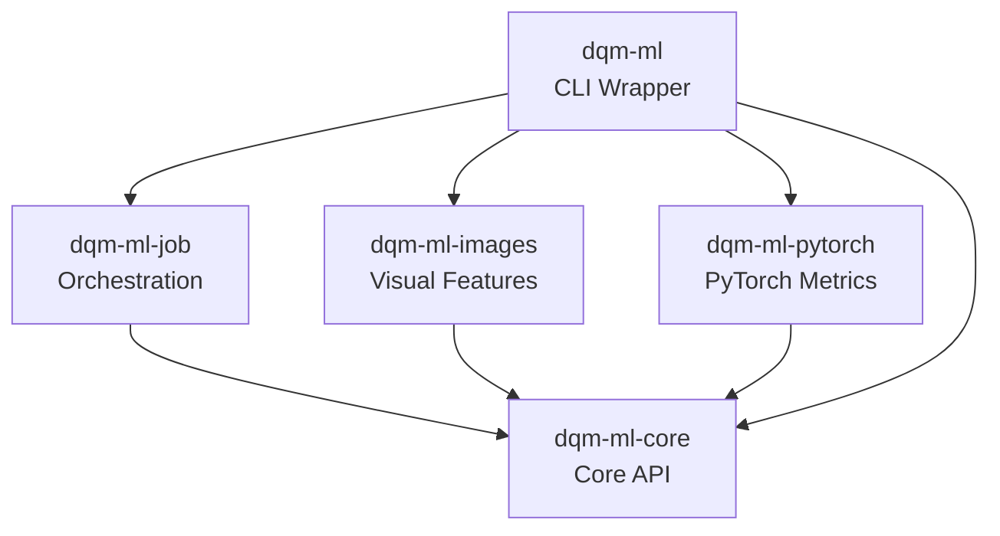

# DQM-ML V2 Project Overview

This page is for developers who want to understand how DQM-ML is structured and how to work with the codebase. For a general introduction to what DQM-ML does, check out the [Home](index.md) page.

> **See also:** [Concepts](formal_concepts.md) for definitions of **Metric**, **Batch Metric**, **Data Selection**, **Processor**, and related terminology used throughout this page.

## Package Architecture

The project is organized as a Python monorepo using [uv workspace](https://github.com/astral-sh/uv).

### Directory Structure

```
dqm-ml-workspace/
├── packages/
│   ├── dqm-ml-core/          # Core API & standard metrics
│   ├── dqm-ml-job/           # Pipeline orchestration & data loaders
│   ├── dqm-ml-images/        # Image feature extraction
│   ├── dqm-ml-pytorch/       # PyTorch-based metrics (Domain Gap)
│   └── dqm-ml/            # CLI wrapper & entry point
├── tests/                    # Test suite
├── docs/                     # Documentation
└── examples/                 # Example configurations
```

Here's how the packages relate to each other:



### What Each Package Does

| Package | Purpose |
|---------|---------|
| **dqm-ml-core** | Defines the base `Processor` class and three interfaces: `MetricsProcessor`, `FeaturesProcessor`, `GapProcessor`. Provides core metrics (Completeness, Representativeness, Diversity). |
| **dqm-ml-job** | Handles the data pipeline: loading data, processing batches, and writing results. Think of it as the "engine room." |
| **dqm-ml-images** | Extracts visual features from images (luminosity, contrast, blur, entropy) - useful for checking image dataset quality. |
| **dqm-ml-pytorch** | Provides `GapProcessor` (Domain Gap) and `FeaturesProcessor` (Image Embeddings) - metrics that need PyTorch. |
| **dqm-ml** | The CLI entry point - what you use from the command line to run jobs. |

## Key Technologies

DQM-ML uses these tools to be fast and reliable:

- **[uv](https://github.com/astral-sh/uv)**: Fast Python package manager and workspace orchestrator
- **[PyArrow](https://arrow.apache.org/)**: Efficient batch processing and memory-efficient data handling
- **[nox](https://nox.thea.codes/)**: Task runner for testing, linting, and documentation
- **[mkdocs-material](https://squidfunk.github.io/mkdocs-material/)**: The beautiful documentation you're reading now

## Building and Running

Here's how to get started with development:

### Setup

```bash
# Synchronize workspace and install dependencies
uv sync
```

### Running the CLI

The main entry point is the `dqm-ml` CLI:

```bash
# List available metrics and data loaders
uv run dqm-ml list

# Execute a pipeline from a configuration file
uv run dqm-ml process -p config.yaml
```

### Testing and Quality Checks

We maintain high code quality with automated checks:

```bash
# Run all tests, linting, and type checking
uv run nox

# Run specific checks
uv run nox -s test      # Run tests
uv run nox -s lint      # Check code style
uv run nox -s type_check # Type checking
uv run nox -s docs      # Build documentation
```

## Developing New Metrics

If you want to add a new metric (awesome!), here's how it works:

### Three Processor Interfaces

DQM-ML V2 defines three distinct processor interfaces, each with its own base class:

| Interface | Base Class | Purpose |
|-----------|------------|---------|
| **Metrics** | `MetricsProcessor` | Compute aggregated metric scores from data (Completeness, Representativeness, Diversity) |
| **Features** | `FeaturesProcessor` | Extract feature columns from data (Visual Features, Embeddings) |
| **Gap** | `GapProcessor` | Compute pairwise distances between selections (Domain Gap) |

All three inherit from a common `Processor` base class which provides:
- `__init__`, `_check_failure_rate`, `_check_image_fail_fast`, `needed_columns()`, `reset()`

#### MetricsProcessor

Extends `Processor`. Implement:
- `generated_metrics()` → `list[str]` — output metric names
- `extract_columns(batch, prev_features)` → `dict[str, pa.Array]` — select columns (optional, default in base)
- `compute_batch_metric(features)` → `dict[str, pa.Array]` — batch statistics
- `compute(batch_metrics)` → `dict[str, Any]` — final scores

#### FeaturesProcessor

Extends `Processor`. Implement:
- `generated_features()` → `list[str]` — output feature column names
- `compute_features(batch, prev_features)` → `dict[str, pa.Array]` — new feature columns
- `needed_columns()` → `list[str]` — input columns needed (optional, default: `input_columns`)

#### GapProcessor

Extends `Processor`. Implement:
- `extract_features(batch, prev_features)` → `dict[str, pa.Array]` — retrieve embeddings
- `compute_batch_metric(features)` → `dict[str, pa.Array]` — batch statistics
- `compute(batch_metrics)` → `dict[str, Any]` — final scores
- `compute_delta(source, target)` → `dict[str, Any]` — pairwise distances

### Data Loading Pattern

Data loaders work in two tiers:

1. **`DataLoader`**: Factory that discovers what **Data Selections** are available
2. **`DataSelection`**: Handles iterating through a specific **Data Selection** in **Batches**

## Coding Standards

We keep the codebase consistent with these tools:

- **Linting**: [ruff](https://docs.astral.sh/ruff/) - Line length is 120 characters
- **Type Checking**: [mypy](https://mypy-lang.org/) - Strict mode enabled
- **Formatting**: `ruff format` - Consistent code style
- **Testing**: pytest with 300-second timeout per test

### Running Quality Checks

```bash
# Fix auto-fixable issues
uv run nox -s lint_fix

# Run type checking
uv run nox -s type_check
```
