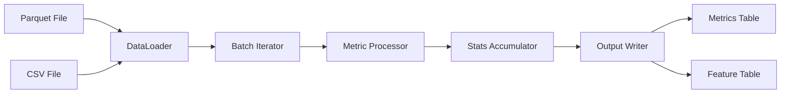

# Why DQM-ML V2?

Curious about why we rebuilt DQM-ML from scratch? This page explains the design decisions behind V2 and how the streaming architecture works. For a general introduction, check out the [Home](index.md) page.

## The Problem with V1

The original `dqm-ml` library worked well for small datasets, but had limitations:

- **Memory issues**: Loading entire datasets into Pandas DataFrames crashed on large files
- **Fixed metrics**: Adding new metrics required modifying core code
- **Tight coupling**: You needed all dependencies even if using just one metric

## How V2 Solves This

V2 was designed around four key principles:

1. **Streaming**: Process data in batches without loading everything into memory
2. **Modularity**: Install only what you need (don't need PyTorch? Don't install it!)
3. **Extensibility**: Add new metrics via plugins without touching core code
4. **Unified API**: One consistent interface for all metric types

## Core Architecture

The system splits responsibilities into three main components:

| Component | What it does |
|----------|--------------|
| **DataLoader** | Discovers available data (parquet files, CSV files, etc.) |
| **DataSelection** | Iterates through data in manageable batches |
| **Metric Processor** | Computes features and statistics on each batch |
| **Output Writer** | Saves results to your preferred format |

## How Streaming Works

Think of the streaming pipeline like a factory assembly line:

**Step by step:**

1. **DataLoader** finds your data (parquet, CSV, etc.)
2. **Batch Iterator** processes data in chunks (typically 10,000 rows at a time)
3. **Metric Processor** runs on each batch, computing partial statistics
4. **Stats Accumulator** combines results from all batches
5. **Final Metrics** aggregates everything into dataset-level scores
6. **Output Writer** saves results to disk

### Why This Matters

With streaming, you can now process datasets **larger than your available RAM**. Whether you have a 100MB or 100GB file, memory usage stays constant.

## Performance Improvements

V2 shows significant improvements over V1:

| Metric | V1 | V2 | Improvement |
|--------|----|----|-------------|
| Memory usage | Full dataset in RAM | Constant (batch size) | ~10-100x less |
| Large Parquet files | Slow / crashes | Fast streaming | ~2-5x faster |
| Adding new metrics | Modify core code | Plugin system | No core changes needed |

## What's Different from V1

| Feature | V1 | V2 |
|--------|----|----|
| Data handling | Load into memory | Stream in batches |
| New metrics | Modify core | Plugin system |
| Dependencies | All or nothing | Install only what you need |
| API | ad-hoc | Unified `DatametricProcessor` |
| Image features | Separate tool | Built into pipeline |

The legacy `dqm-ml` package is still available as a submodule for reference, but new development should use the V2 API.
