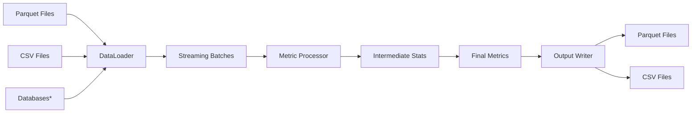
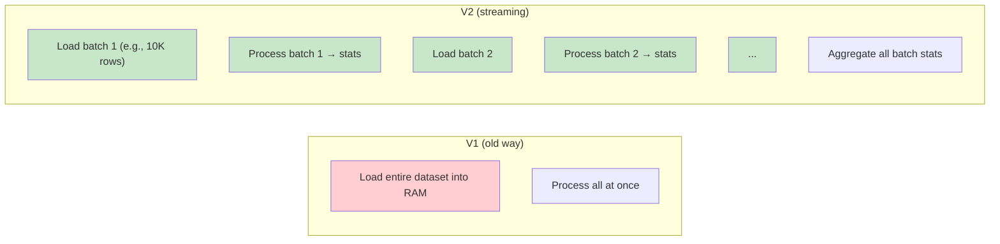

# Why DQM-ML V2?

Curious about why we rebuilt DQM-ML from scratch? This page explains the design decisions behind V2 and how the streaming architecture works. For a general introduction, check out the [Home](index.md) page.

> **See also:** [Concepts](formal_concepts.md) for definitions of **Sample**, **Metric**, **Batch**, **Batch Metric**, **Processor**, and related terminology used throughout this page.

## The Problem with V1

The original `dqm-ml` library worked well for small datasets, but had limitations:

- **Memory issues**: Loading entire datasets into Pandas DataFrames crashed on large files
- **Fixed metrics**: Adding new metrics required modifying core code
- **Tight coupling**: You needed all dependencies even if using just one metric

## How V2 Solves This

V2 was designed around four key principles:

1. **Streaming**: Process data in batches without loading everything into memory
2. **Modularity**: Install only what you need (don't need PyTorch? Don't install it!)
3. **Extensibility**: Add new metrics via plugins without touching core code
4. **Unified API**: One consistent interface for all metric types

## DQM-ML V2 Architecture

Here's how data flows through the DQM-ML V2 system:

\*Databases can be added by implementing and registering a plugin to handle a database source.

**How it works:**

1. **DataLoader** loads your data and creates **Data Selections** from it (Parquet, CSV, etc.)
2. **Streaming Batches** process data in chunks — never loads the whole dataset into memory
3. **Metric Processor** computes **Features** and intermediate **Batch Metric** statistics for each **Batch**
4. **Intermediate Stats** accumulate as batches are processed
5. **Final Metrics** aggregate all intermediate stats into dataset-level **Metric** scores
6. **Output Writer** saves results to your preferred format

## Memory Efficiency (Why Streaming Matters)

Unlike V1, which loads entire datasets into memory, V2 processes data in batches:

### Why This Matters

**Key difference:** With streaming, you can now process datasets **larger than your available RAM**. Whether you have a 100MB or 100GB file, memory usage stays constant.

| Dataset Size | V1 Memory | V2 Memory |
|------------|-----------|-----------|
| 100 MB | ~300 MB | ~10 MB |
| 1 GB | ~3 GB | ~10 MB |
| 100 GB | Crashes | ~10 MB |

## Performance Improvements

V2 shows significant improvements over V1:

| Metric | V1 | V2 | Improvement |
|--------|----|----|-------------|
| Memory usage | Full dataset in RAM | Constant (batch size) | ~10-100x less |
| Large Parquet files | Slow / crashes | Fast streaming | ~2-5x faster |
| Adding new metrics | Modify core code | Plugin system | No core changes needed |

## What's Different from V1

| Feature | V1 | V2 |
|--------|----|----|
| Data handling | Load into memory | Stream in batches |
| New metrics | Modify core | Plugin system |
| Dependencies | All or nothing | Install only what you need |
| API | ad-hoc | Unified `DatametricProcessor` |
| Image features | Separate tool | Built into pipeline |

The legacy `dqm-ml` package is still available for reference, but new development should use the V2 API.