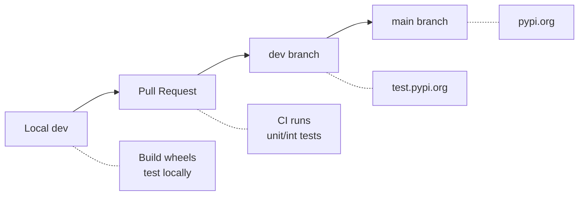

# Packaging Tests

This page documents how to verify that dqm-ml packages can be installed separately for specific purposes. Each package combination is tested in an isolated virtual environment to ensure no unintended dependencies are pulled in.

See also: [Testing Strategy](testing.md) for the full breakdown of test categories.

## Why Package Isolation Matters

DQM-ML is split into optional packages so users only install what they need:

| Package | Purpose | Key dependencies |
|---------|---------|-----------------|
| `dqm-ml-core` | Metrics (completeness, representativeness, diversity) | pyarrow, numpy, scipy |
| `dqm-ml-images` | Visual features (luminosity, contrast, blur, entropy) | pillow, scipy |
| `dqm-ml-pytorch` | Embeddings + gap metrics (MMD, FID) | torch, torchvision, scikit-learn |
| `dqm-ml-job` | CLI + YAML pipeline execution | pyyaml, tqdm |
| `dqm-ml` | CLI facade + optional notebook deps | all of the above (optional) |

Installing `dqm-ml-images` should **not** pull in `torch` or `torchvision` unless explicitly requested. These tests verify that invariant.

## Contributor Workflow

When modifying code in `packages/`, test your changes locally before creating a Pull Request. Since your updated packages are not yet published to PyPI, you must build wheels locally and install from those wheels.

### 1. Build all wheels

```bash
uv build --package dqm-ml-core --wheel --out-dir ./tmp/wheels
uv build --package dqm-ml-images --wheel --out-dir ./tmp/wheels
uv build --package dqm-ml-job --wheel --out-dir ./tmp/wheels
uv build --package dqm-ml-pytorch --wheel --out-dir ./tmp/wheels
uv build --package dqm-ml --wheel --out-dir ./tmp/wheels
```

### 2. Create an isolated venv and install from local wheels

```bash
python3 -m venv ./tmp/test-scenario && source ./tmp/test-scenario/bin/activate
pip install ./tmp/wheels/dqm_ml_core-*.whl   # install only what you need
```

### 3. Run the smoke test script

```bash
python3 tests/packaging/scripts/smoke_core.py
deactivate
```

### 4. Clean up

```bash
rm -rf ./tmp/test-scenario ./tmp/wheels
```

Each scenario below follows this same pattern: build → venv → install from wheels → run script.

## Package Scenarios

### 1. dqm-ml-core only (metrics, no torch)

```bash
python3 -m venv ./tmp/test-core && source ./tmp/test-core/bin/activate
pip install ./tmp/wheels/dqm_ml_core-*.whl
python3 tests/packaging/scripts/smoke_core.py
deactivate
```

Tests completeness and representativeness via the Python API. No job, no images, no pytorch.

### 2. dqm-ml-core + dqm-ml-images (visual features)

```bash
python3 -m venv ./tmp/test-images && source ./tmp/test-images/bin/activate
pip install ./tmp/wheels/dqm_ml_core-*.whl ./tmp/wheels/dqm_ml_images-*.whl
python3 tests/packaging/scripts/smoke_images.py
deactivate
```

Tests `VisualFeaturesProcessor` via ProcessorRunner and direct API. No job.

### 3. dqm-ml-core + dqm-ml-job (metrics via YAML pipeline)

```bash
python3 -m venv ./tmp/test-job && source ./tmp/test-job/bin/activate
pip install ./tmp/wheels/dqm_ml_core-*.whl ./tmp/wheels/dqm_ml_job-*.whl
python3 tests/packaging/scripts/smoke_core_job.py
deactivate
```

Tests that completeness metrics can be executed through `dqm-ml-job` CLI with a YAML config.

### 4. dqm-ml-core + dqm-ml-images + dqm-ml-job (visual features via YAML)

```bash
python3 -m venv ./tmp/test-images-job && source ./tmp/test-images-job/bin/activate
pip install ./tmp/wheels/dqm_ml_core-*.whl ./tmp/wheels/dqm_ml_images-*.whl ./tmp/wheels/dqm_ml_job-*.whl
python3 tests/packaging/scripts/smoke_images_job.py
deactivate
```

Tests that visual features can be executed through `dqm-ml-job` CLI with a YAML config.

### 5. dqm-ml-core + dqm-ml-pytorch (embedding features)

```bash
python3 -m venv ./tmp/test-embeddings && source ./tmp/test-embeddings/bin/activate
pip install --extra-index-url https://download.pytorch.org/whl/cpu ./tmp/wheels/dqm_ml_core-*.whl ./tmp/wheels/dqm_ml_pytorch-*.whl
python3 tests/packaging/scripts/smoke_embeddings.py
deactivate
```

Tests `ImageEmbeddingProcessor` via ProcessorRunner. No gap, no job.

### 6. dqm-ml-core + dqm-ml-pytorch (gap metrics)

```bash
python3 -m venv ./tmp/test-gap && source ./tmp/test-gap/bin/activate
pip install --extra-index-url https://download.pytorch.org/whl/cpu ./tmp/wheels/dqm_ml_core-*.whl ./tmp/wheels/dqm_ml_pytorch-*.whl
python3 tests/packaging/scripts/smoke_gap.py
deactivate
```

Tests `DomainGapProcessor` with pre-computed embeddings (MMD linear and RBF). No job.

### 7. dqm-ml-core + dqm-ml-pytorch + dqm-ml-job (embeddings + gap via YAML)

```bash
python3 -m venv ./tmp/test-pytorch && source ./tmp/test-pytorch/bin/activate
pip install --extra-index-url https://download.pytorch.org/whl/cpu ./tmp/wheels/dqm_ml_core-*.whl ./tmp/wheels/dqm_ml_pytorch-*.whl ./tmp/wheels/dqm_ml_job-*.whl
python3 tests/packaging/scripts/smoke_pytorch.py
deactivate
```

Tests embeddings and gap metrics through YAML config with `dqm-ml-job`.

### 8. dqm-ml-core + dqm-ml-images + dqm-ml-pytorch + dqm-ml-job (all metrics, no notebooks)

```bash
python3 -m venv ./tmp/test-all && source ./tmp/test-all/bin/activate
pip install --extra-index-url https://download.pytorch.org/whl/cpu ./tmp/wheels/dqm_ml_core-*.whl ./tmp/wheels/dqm_ml_images-*.whl ./tmp/wheels/dqm_ml_pytorch-*.whl ./tmp/wheels/dqm_ml_job-*.whl
python3 tests/packaging/scripts/smoke_all.py
deactivate
```

Tests all metric types: completeness, representativeness, visual features, embeddings, and gap metrics.

### 9. All packages including dqm-ml (all metrics + notebooks)

```bash
python3 -m venv ./tmp/test-notebooks && source ./tmp/test-notebooks/bin/activate
pip install --extra-index-url https://download.pytorch.org/whl/cpu ./tmp/wheels/dqm_ml_core-*.whl ./tmp/wheels/dqm_ml_images-*.whl ./tmp/wheels/dqm_ml_pytorch-*.whl ./tmp/wheels/dqm_ml_job-*.whl "$(ls ./tmp/wheels/dqm_ml-*.whl)[notebooks]"
python3 tests/packaging/scripts/smoke_notebooks.py
deactivate
```

Tests that all packages import correctly and notebook dependencies (jupyter, plotly, matplotlib) are available.

## CI/CD Lifecycle



### Local development

Build wheels from your local branch and test as described above. Your packages are not on any index yet — you install exclusively from local wheel files.

### After PR merge to dev

The CI pipeline builds wheels and pushes them to [test.pypi.org](https://test.pypi.org). You can now re-run the same scenarios using the test index instead of local wheels. Replace:

```bash
pip install ./tmp/wheels/dqm_ml_core-*.whl
```

with:

```bash
pip install --index-url https://test.pypi.org/simple/ --extra-index-url https://pypi.org/simple/ dqm-ml-core
```

!!! note
    `--extra-index-url` is needed because test-pypi may not host all transitive dependencies (e.g. `torch`). The extra index lets pip fall back to regular PyPI for those.

For example, to re-run scenario 1 (metrics only) from test-pypi:

```bash
python3 -m venv ./tmp/test-core && source ./tmp/test-core/bin/activate
pip install --index-url https://test.pypi.org/simple/ --extra-index-url https://pypi.org/simple/ dqm-ml-core
python3 tests/packaging/scripts/smoke_core.py
deactivate
```

### After dev merge to main

The CI pipeline pushes to [pypi.org](https://pypi.org). Packages are now publicly available:

```bash
pip install dqm-ml-core
```
