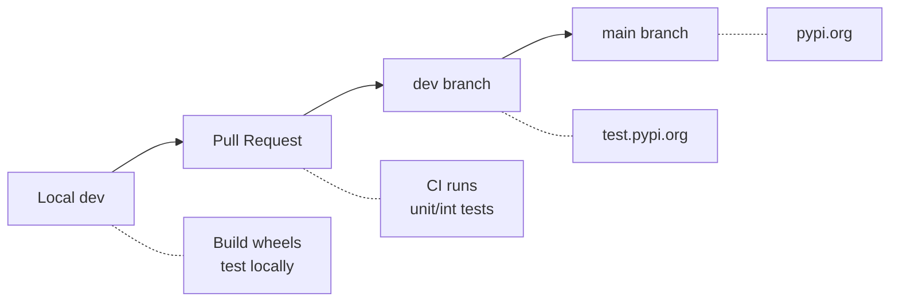

# Packaging Tests

This page documents how to verify that dqm-ml packages can be installed separately for specific purposes. Each package combination is tested in an isolated virtual environment to ensure no unintended dependencies are pulled in.

See also: [Testing Strategy](testing.md) for the full breakdown of test categories.

## Why Package Isolation Matters

DQM-ML is split into optional packages so users only install what they need:

| Package | Purpose | Key dependencies |
|---------|---------|-----------------|
| `dqm-ml-core` | Metrics (completeness, representativeness, diversity) | pyarrow, numpy, scipy |
| `dqm-ml-images` | Visual features (luminosity, contrast, blur, entropy) | pillow, scipy |
| `dqm-ml-pytorch` | Embeddings + gap metrics (MMD, FID) | torch, torchvision, scikit-learn |
| `dqm-ml-job` | CLI + YAML pipeline execution | pyyaml, tqdm |
| `dqm-ml` | CLI facade + optional notebook deps | all of the above (optional) |

Installing `dqm-ml-images` should **not** pull in `torch` or `torchvision` unless explicitly requested. These tests verify that invariant.

## Test Scripts

Four shell scripts cover different package sources. Each runs all 9 scenarios (or a single one by number).

| Script | Package Source | When to Use |
|--------|---------------|-------------|
| `scripts/packaging/test_local.sh` | Locally built wheels | Before PR — tests your local changes |
| `scripts/packaging/test_pypi_prerelease.sh` | PyPI pre-release | After push to dev — tests rc/alpha from PyPI |
| `scripts/packaging/test_testpypi_prerelease.sh` | test.pypi.org pre-release | After push to dev — tests rc/alpha from test-pypi |
| `scripts/packaging/test_pypi_release.sh` | PyPI release | After release — tests stable version |

### Usage

```bash
# Run all 9 scenarios
scripts/packaging/test_local.sh

# Run a single scenario (e.g., scenario 3: dqm-ml-core + dqm-ml-job)
scripts/packaging/test_local.sh 3
```

All scripts:

- Create isolated venvs with `uv venv --python 3.12`
- Set `TMPDIR=scripts/packaging/tmp` to avoid disk quota issues on `/tmp`
- Print full uv/pip output for easy debugging
- Report pass/fail per scenario with color output
- Exit non-zero if any scenario fails

## Scenarios

| # | Name | Packages | Smoke Script | Tests |
|---|------|----------|-------------|-------|
| 1 | Core only | dqm-ml-core | smoke_core.py | Completeness, representativeness via Python API |
| 2 | Images | dqm-ml-core, dqm-ml-images | smoke_images.py | VisualFeaturesProcessor via ProcessorRunner |
| 3 | Job | dqm-ml-core, dqm-ml-job | smoke_core_job.py | Completeness metrics through CLI with YAML config |
| 4 | Images + Job | dqm-ml-core, dqm-ml-images, dqm-ml-job | smoke_images_job.py | Visual features through CLI with YAML config |
| 5 | Embeddings | dqm-ml-core, dqm-ml-pytorch | smoke_embeddings.py | ImageEmbeddingProcessor via ProcessorRunner |
| 6 | Gap | dqm-ml-core, dqm-ml-pytorch | smoke_gap.py | DomainGapProcessor with pre-computed embeddings (MMD) |
| 7 | PyTorch + Job | dqm-ml-core, dqm-ml-pytorch, dqm-ml-job | smoke_pytorch.py | Embeddings and gap metrics through YAML config |
| 8 | All | dqm-ml-core, dqm-ml-images, dqm-ml-pytorch, dqm-ml-job | smoke_all.py | All metric types: completeness, visual, embeddings, gap |
| 9 | Notebooks | dqm-ml-core, dqm-ml-images, dqm-ml-pytorch, dqm-ml-job, dqm-ml[notebooks] | smoke_notebooks.py | All packages + notebook dependencies (jupyter, plotly, matplotlib) |

## CI/CD Lifecycle



## Manual Testing

For quick one-off tests without running all scenarios via scripts.

### Local wheels

Build wheels locally, install in an isolated venv, and run a smoke test.

```bash
export TMPDIR=$(pwd)/tmp

# Build all wheels
uv build --package dqm-ml-core --wheel --out-dir ./tmp/wheels
uv build --package dqm-ml-images --wheel --out-dir ./tmp/wheels
uv build --package dqm-ml-job --wheel --out-dir ./tmp/wheels
uv build --package dqm-ml-pytorch --wheel --out-dir ./tmp/wheels
uv build --package dqm-ml --wheel --out-dir ./tmp/wheels

# Test scenario 3: dqm-ml-core + dqm-ml-job
uv venv --python 3.12 ./tmp/test-job
uv pip install --python ./tmp/test-job/bin/python ./tmp/wheels/dqm_ml_core-*.whl ./tmp/wheels/dqm_ml_job-*.whl
./tmp/test-job/bin/python scripts/packaging/smoke/smoke_core_job.py

# Cleanup
rm -rf ./tmp
```

### PyPI pre-release

Install and test a pre-release version directly from PyPI.

```bash
export TMPDIR=$(pwd)/tmp

# Scenario 1: dqm-ml-core
uv venv --python 3.12 ./tmp/test-core
uv pip install --python ./tmp/test-core/bin/python --pre dqm-ml-core
./tmp/test-core/bin/python scripts/packaging/smoke/smoke_core.py

# Scenario 6: dqm-ml-core + dqm-ml-pytorch (gap)
PYPI_FLAGS="--prerelease=allow --extra-index-url https://download.pytorch.org/whl/cpu"
uv venv --python 3.12 ./tmp/test-gap
uv pip install --python ./tmp/test-gap/bin/python $PYPI_FLAGS dqm-ml-core dqm-ml-pytorch
./tmp/test-gap/bin/python scripts/packaging/smoke/smoke_gap.py

# Cleanup
rm -rf ./tmp
```
