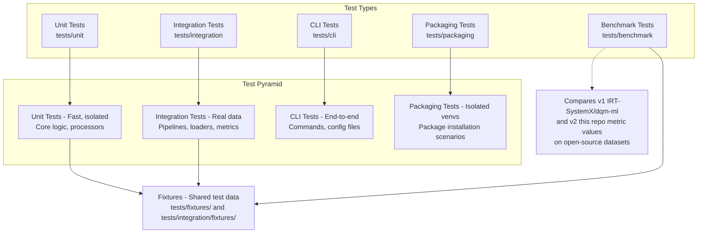

# Testing Strategy

This page describes how tests are organized in DQM-ML and how to add new tests.

## Test Organization



## Test Directory Structure

```
tests/
├── conftest.py              # Pytest configuration & fixture imports
├── fixtures/                # Shared cross-test fixtures
│   ├── cli_fixtures.py     # CLI environment fixtures
│   ├── stress_images.py    # Stress test image generators
│   └── test_fixtures.py    # Generic test fixtures (mock data, temp paths)
├── utils/                   # Utility functions for tests
│   ├── files.py            # File handling helpers
│   ├── jobs.py             # Job configuration helpers
│   ├── pipeline_configs.py # Pipeline config builders
│   └── plots.py            # Visualization helpers
├── unit/                    # Unit tests (fast, isolated)
│   ├── core/               # Core API tests (data_processor, metric_runner)
│   ├── pipeline/           # Pipeline tests (loaders, writers)
│   └── v2/                 # CLI wrapper tests
├── integration/             # Integration tests (synthetic data)
│   ├── fixtures/           # Integration-specific fixtures and data
│   │   ├── config.py      # Configuration fixtures
│   │   ├── data.py        # Data fixtures
│   │   ├── jobs.py        # Job configuration fixtures
│   │   └── paths.py       # Path fixtures
│   ├── test_completeness.py
│   ├── test_representativeness.py
│   ├── test_domain_gap.py
│   ├── test_visual_features.py
│   └── test_pandas_welding.py
├── packaging/               # Package isolation tests
│   ├── conftest.py         # Wheel build & venv fixtures
│   ├── test_package_isolation.py  # Parametrized isolation tests
│   └── scripts/            # Smoke-test scripts for each scenario
├── benchmark/               # Benchmark tests (record metric values)
│   └── test_benchmark_domain_gap.py
└── cli/                     # CLI end-to-end tests
    ├── test_v2_wrapper.py
    └── test_job_cli.py
```

## Test Fixtures

DQM-ML uses pytest fixtures for reusable test data. Here's what's available:

| Fixture | Scope | Purpose | Usage |
|---------|-------|---------|-------|
| `test_path` | session | Tests directory path | All test files |
| `output_path` | session | Output directory for test results | Integration tests |
| `coco_data` | session | COCO dataset for domain gap tests | `test_domain_gap.py` |
| `normal_dist` | function | Normal distribution sample | Representativeness tests |
| `not_normal_dist` | function | Non-normal distribution | Statistical tests |
| `uniform_dist` | function | Uniform distribution | Statistical tests |
| `not_uniform_dist` | function | Non-uniform distribution | Statistical tests |
| `job_completeness` | function | Completeness job config | Pipeline tests |
| `job_representativeness` | function | Representativeness job config | Pipeline tests |
| `job_domain_gap` | function | Domain gap job config | Pipeline tests |
| `job_visual_features` | function | Visual features job config | Pipeline tests |
| `all_classes` | session | All available pipeline classes | CLI tests |
| `coco_data_dir` | session | Path to COCO data directory | Benchmark tests |
| `coco_parquet_path` | session | Path to COCO parquet file | Benchmark tests |
| `mock_parquet_dataset` | function | Small mock Parquet dataset | Unit tests |
| `sample_dataframe` | function | Small sample DataFrame | Unit tests |
| `temp_output_path` | function | Temporary output directory | All test types |

**Example using fixtures**:

```python
import pytest

def test_completeness_with_data(
    test_path: str,
    uniform_dist: Any
) -> None:
    """Test completeness metric with uniform distribution."""
    processor = CompletenessProcessor(
        name="test",
        config={"columns": {"input": ["feature"]}}
    )
    result = processor.compute({})
    assert result is not None
```

## Running Tests

```bash
# All tests with coverage report
uv run nox -s test

# Fast mode (skip slow tests)
uv run pytest -m "not slow"

# Specific test file
uv run pytest tests/integration/test_completeness.py

# With verbose output
uv run pytest -v tests/

# Run only unit tests
uv run pytest tests/unit/

# Run with coverage for specific package
uv run pytest --cov=packages/dqm-ml-core tests/

# Run only packaging isolation tests
uv run pytest -m packaging tests/packaging/
```

## Adding a New Test

1. **Choose test type**:
    - **Unit tests**: `tests/unit/package_name/` - fast, isolated tests of classes and functions
    - **Integration tests**: `tests/integration/` - tests that call `dqm-ml process` with YAML configs on synthetic data
    - **CLI tests**: `tests/cli/` - end-to-end tests of command-line usage
    - **Packaging tests**: `tests/packaging/` - package-isolation tests that verify subsets of packages work independently (see [Packaging Tests](packaging-tests.md))
    - **Benchmark tests**: `tests/benchmark/` - compute metrics on open-source datasets (COCO) to compare metric values between [v1](https://github.com/IRT-SystemX/dqm-ml) and v2 (this repo); no pass/fail assertions, records results for manual inspection

2. **Follow naming conventions**:
    - Test files: `test_*.py`
    - Test functions: `test_*`
    - Use descriptive names: `test_completeness_returns_valid_score`

3. **Use existing fixtures**:
    ```python
    def test_my_feature(test_path: str, uniform_dist: Any) -> None:
        # Your code using fixtures
        pass
    ```

4. **Mark slow tests** (if your test takes >30s):
    ```python
    @pytest.mark.slow
    def test_slow_operation() -> None:
        # This test will be skipped with -m "not slow"
        pass
    ```

## Test Data Sources

| Type | Source | When to Use |
|------|--------|--------------|
| **Synthetic** | Generated via fixtures (normal_dist, uniform_dist) | Most unit/integration tests |
| **Real datasets** | COCO-2017 via `fiftyone.zoo` | Domain gap tests |
| **Example data** | `examples/config/` | CLI tests |

## Test Coverage & Results

After running tests, reports are generated:

| Report | Location | Description |
|--------|----------|-------------|
| Coverage HTML | `docs/reports/htmlcov/index.html` | Line-by-line coverage |
| Test Results HTML | `docs/reports/pytest/pytest_report.html` | Test execution report |

## CI/CD Testing

Tests run automatically on every push via GitHub Actions:

- **Lint**: Code style with ruff
- **Type Check**: Type safety with mypy
- **Test**: Full test suite with pytest
- **Docs**: Documentation build

See the [README](https://github.com/anomalyco/dqm-ml-workspace#readme) for current status badges.
